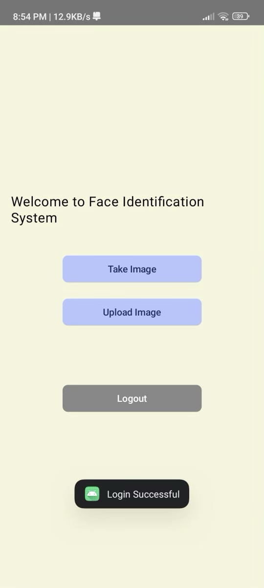
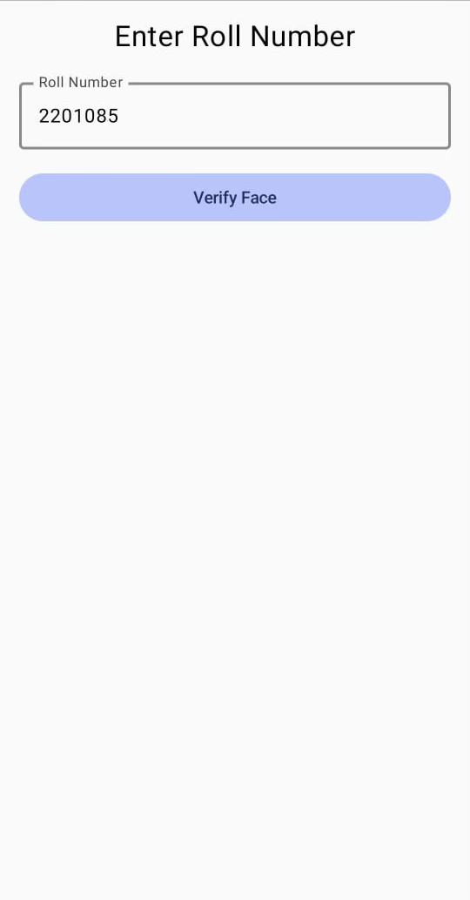
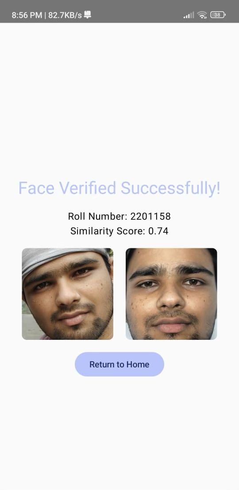
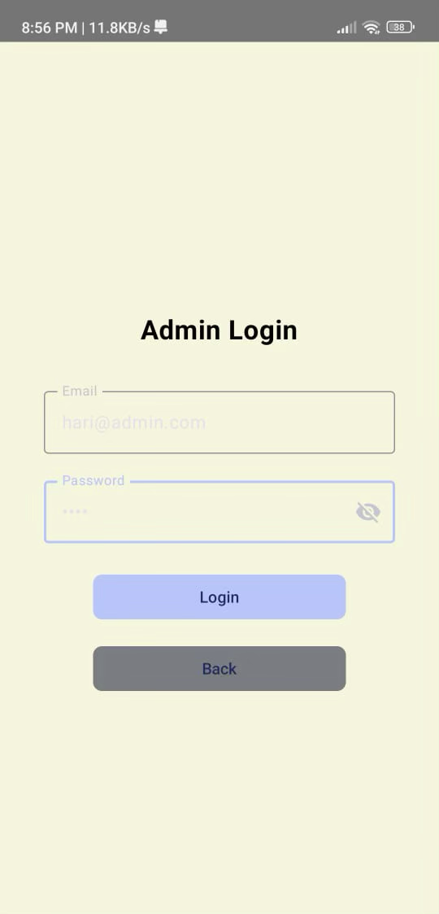
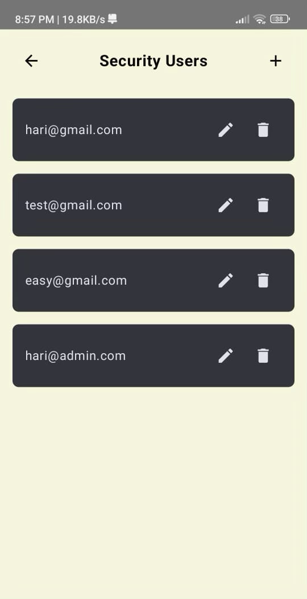
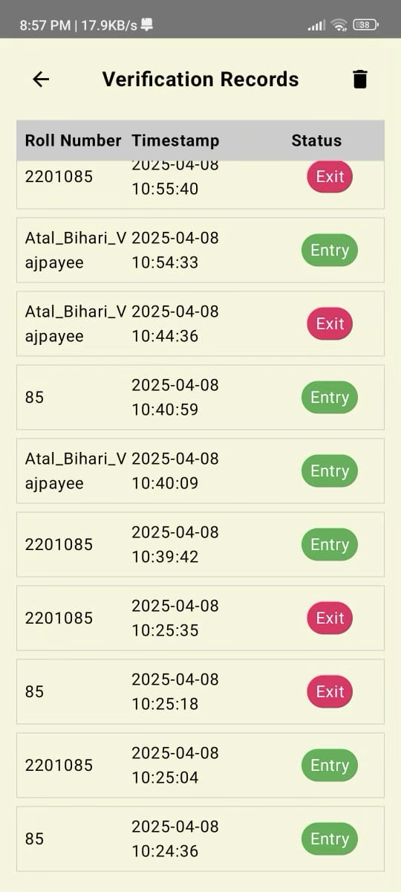

# FaceID

A secure face and ID verification access system powered by **InsightFace**, **Kotlin**, and **Python**.

## 🚀 Overview

**FaceID** is a real-time identity verification system that uses facial recognition combined with ID card parsing to control and log access securely. Built for environments requiring tight access control, the system integrates machine learning, mobile interfaces, and backend automation.

## 🧠 Tech Stack

- **Frontend**: Kotlin (Jetpack Compose)
- **Backend**: Python(3.13.5) (FastAPI)
- **Face Recognition**: InsightFace (ArcFace model)
- **Database**: SQLite (configurable)
- **Deployment**: Not Ready Yet

## ✨ Features

- 🔍 Real-time face + ID verification using live camera input
- 🧾 Automated access logging with timestamps and status
- 🛡️ Admin panel for regulating and reviewing access events
- 📱 User-friendly Android UI for seamless operation
- 📷 ML-powered extraction of roll number from ID card
- ✅ Face matching using 512-D embeddings and ArcFace

## 📂 Project Structure
<pre>
```
FaceID/
├── Create_Database/              # First you need to create a user database which are going to access the permises
    ├── Valid_User_Database/      # Add your user's images named by ID(Rollno) to this folder 
    ├── NewClearDB.py
    ├── NewDBInsight.py
    └── NewStoreEmbedding.py      # Run this file to generate User.db then transfer that file to FaceID_Backend/app/ml

├── FaceID_Backend/               # FastAPI server, ML models, database logic
    ├── app/                      # Main SRC folder that contains complete backend logic
        ├── ml/                   # Folder which contain core face recognition logic
            ├── User.db
            ├── databaselog.txt   
            ├── ml_init.py
            ├── ml_process.py
            └── ml_verify.py
        ├── __init__.py
        ├── auth.py
        ├── clear_record.py
        ├── database.py
        ├── main.py               # Main file which needed to be run to make backend running, sends response to requests
        ├── models.py
        ├── record_logger.py
        ├── utils.py
        └── view_record.py
    ├── uploads/                  # Here your uploaded/captured image will be stored for processing (keep on replacing)
        └── ...
    ├── faceid_users.db           # This is database of Security personals allowed by admin to use this app
    └── records.db                # Contains Entry/Exit logs

├── Google_Colab_File/            # This contains code for large dataset to be run on colab to compute Bayesian Threshold
    ├── CALFW_Image_Dataset/
    ├── Final_Result/             # Gives a highly detailed result upon running files in proper order (*check file paths)
    └── ...

├── frontend/                     # Jetpack Compose Android app
    ├── Basicapp                  # Contains complete Andorid app package
    └── .gitignore             

├── Screenshots/                  # Sample Screenshots of the Andorid app in use
├── .gitignore
├── LICENSE
├── Project_Report.pdf            # A detailed report over learning, experiment and observations (*For institute purpose)
├── README.md
└── requirements.txt
```
</pre>

## 🛠️ Setup Instructions

### Initial Setup

Create virtual environment using requirememts.txt
```bash
cd FaceID
python -m venv venv
source venv/bin/activate
pip install -r requirements.txt
```

Create Database of users who will be accessing the permises:
1. Save images of all such users named by their ID(Rollno.) in 'FaceID/Create_Database/Valid_User_Database' (A sample is already given).
2. Run NewStoreEmbedding.py file which will generate "User.db" file.
3. Move "User.db" to 'FaceID_Backend/app/ml'.

### Google Collab File(Optional)
1. Replace Dataset: CALFW_Image_Dataset with your required one (Or this is best).
2. Check the paths of files in code according to your google colab directories.
3. Run files according to your required sequence (your will get to know that easily).
4. Final results will be stored in Final_Results directory. This will give a detailed output in graph and texts and you can select your desired Bayesian threshold.

### Backend
You might need to install onxxruntime and Insightface from github "https://github.com/deepinsight/insightface" in your local machine.
```bash
cd FaceID_Backend
uvicorn app.main:app --host 0.0.0.0 --port 8000 --reload
```
This will make your backend running and able to receive and send requests.
Find your IP address and note it down it will be required in frontend 
(*Make sure both frontend and backend are running on same IP address)

### Frontend
Open Basicapp folder in Android Studio
Make these changes
1. IP address in 'BasicApp/app/src/main/java/com/example/basicapp/api/RetrofitInstance.kt' and 'BasicApp/app/src/main/res/xml/network_security_config.xml'. Change given IP address with the one you got in previous(backend) step.
2. Go to file 'BasicApp/app/src/main/java/com/example/basicapp/screens/AdminUIScreen.kt' line 95 and set admin username and password according to your convenience.

Now build the app and get apk, install on your device.
Login to admin dashboard using above ID and password then create Security personal and share them with the security person which now can use this app to automatically log access details using Face and ID verification.


## 🤝 Contributing

We welcome contributions! If you'd like to fix a bug, improve documentation, or add a new feature, please check out our [contributing guidelines](CONTRIBUTING.md) to get started.

## 🙌 Acknowledgements

This project combines open-source tools and frameworks including [InsightFace](https://github.com/deepinsight/insightface), [FastAPI](https://fastapi.tiangolo.com/), and [Jetpack Compose](https://developer.android.com/jetpack/compose). Special thanks to the developers and maintainers of these amazing libraries.

---

### 📫 Contact

Have questions or feedback? Feel free to reach out or open an issue on GitHub.

---

Thank you for checking out **FaceID**! We hope it inspires new ideas in secure access systems using AI. 🚀


## 📸 Sample Screenshots

<div style="display: flex; flex-wrap: wrap; gap: 15px; justify-content: center;">
  
  
  
  
  
  
</div>
For More visit Screenshot directory