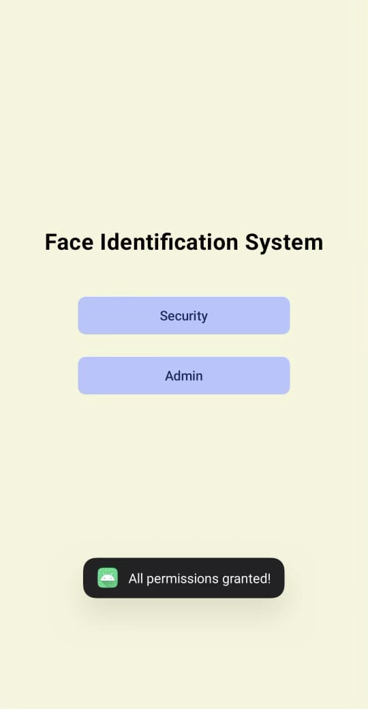
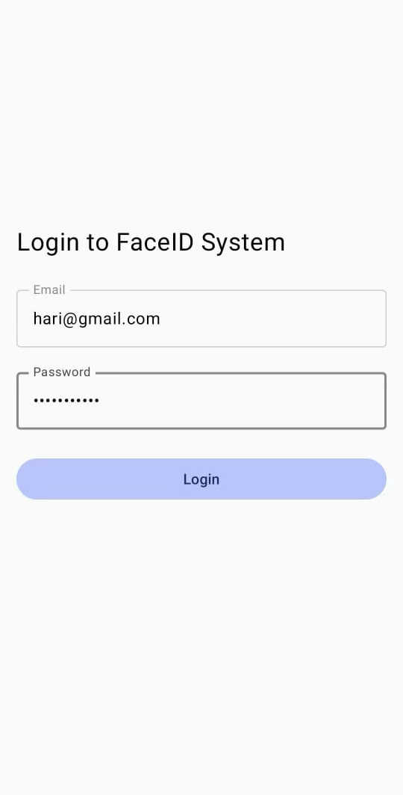
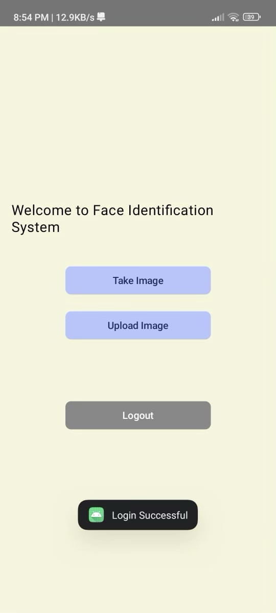
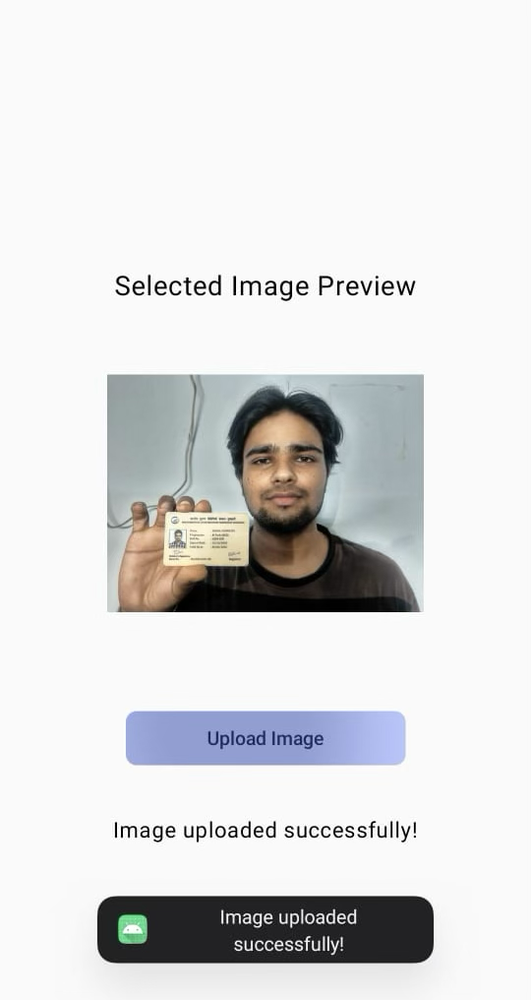
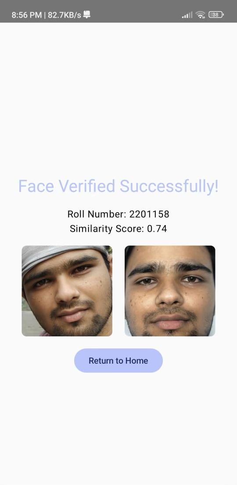
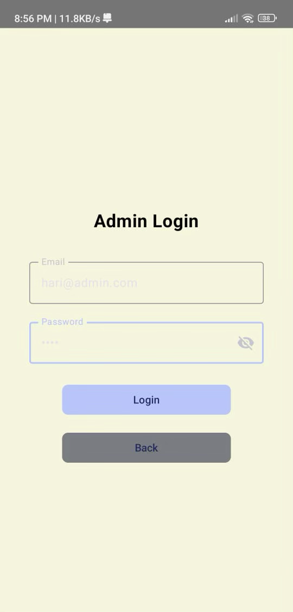
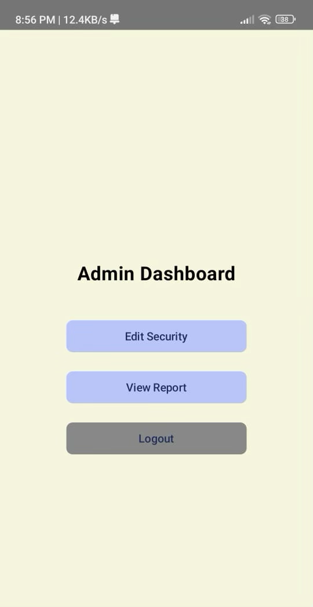
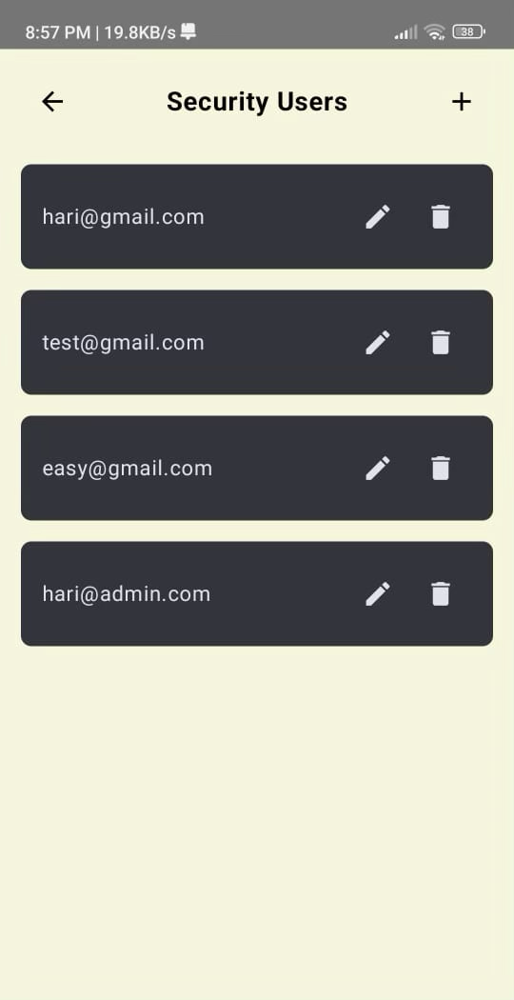
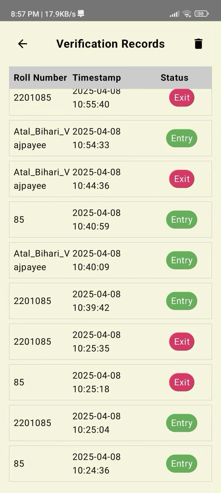

# FaceID

A secure face and ID verification access system powered by **InsightFace**, **Kotlin**, and **Python**.

## 🚀 Overview

**FaceID** is a real-time identity verification system that uses facial recognition combined with ID card parsing to control and log access securely. Built for environments requiring tight access control, the system integrates machine learning, mobile interfaces, and backend automation.

## 🧠 Tech Stack

- **Frontend**: Kotlin (Jetpack Compose)
- **Backend**: Python (FastAPI)
- **Face Recognition**: InsightFace (ArcFace model)
- **Database**: SQLite (configurable)
- **Deployment**: Not Ready Yet

## ✨ Features

- 🔍 Real-time face + ID verification using live camera input
- 🧾 Automated access logging with timestamps and status
- 🛡️ Admin panel for regulating and reviewing access events
- 📱 User-friendly Android UI for seamless operation
- 📷 ML-powered extraction of roll number from ID card
- ✅ Face matching using 512-D embeddings and ArcFace

## 📸 Sample Screenshots













## 📂 Project Structure
<pre>
```
FaceID/
├── Create_Database/
    ├── Valid_User_Database/
    ├── NewClearDB.py
    ├── NewDBInsight.py
    └── NewStoreEmbedding.py
├── FaceID_Backend/                   # FastAPI server, ML models, database logic
    ├── app/
        ├── ml/
            ├── User.db
            ├── databaselog.txt
            ├── ml_init.py
            ├── ml_process.py
            └── ml_verify.py
        ├── __init__.py
        ├── auth.py
        ├── clear_record.py
        ├── database.py
        ├── main.py
        ├── models.py
        ├── record_logger.py
        ├── utils.py
        └── view_record.py
    ├── uploads/
        └── ...
    ├── faceid_users.db
    └── records.db
├── Google_Colab_File/
    ├── CALFW_Image_Dataset/
    ├── Final_Result/
    └── ...
├── frontend/                  # Jetpack Compose Android app
    └── ...
├── .gitignore
├── LICENSE
├── Project_Report.pdf
├── README.md
└── requirements.txt
```
</pre>

## 🛠️ Setup Instructions

### Backend

```bash
cd backend
python -m venv venv
source venv/bin/activate
pip install -r requirements.txt
uvicorn main:app --reload
```

### Frontend
First you need to change the IP address in built 
Then build APK and run on your device
For admin restricted is limited to changes in frontend so add your username and password in frontend itself

